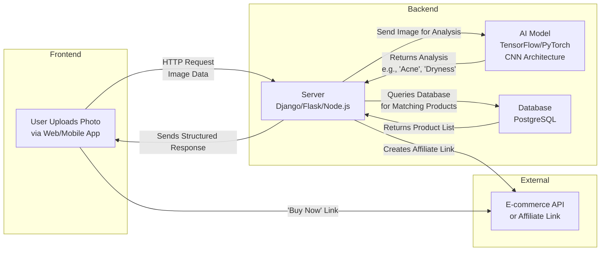

# SkinCareAI Project

## System Architecture Flowchart

## Description
This flowchart illustrates the end-to-end workflow of the SkinCareAI system, from user image upload to product recommendation and purchase link generation.

# Project main folder structures
skinsavvy/ (or SKINCAREAL/)
│
├── 📁 backend/                 # Node.js/Express API Server
├── 📁 frontend/                # React.js Web Application
├── 📁 ai-model/                # Python AI/ML Service
├── 📁 docker/                  # Docker Configuration for Development
│   ├── nginx/
│   │   └── nginx.conf
│   ├── Dockerfile.backend
│   ├── Dockerfile.frontend
│   ├── Dockerfile.ai
│   └── docker-compose.yml      # For local development
│
├── 📁 infrastructure/          # NEW: CLOUD DEPLOYMENT & PROVISIONING (AWS EC2)
│   ├── 📁 aws-ec2/             # Configuration for AWS EC2
│   │   ├── deploy.sh           # Main deployment script to run on EC2
│   │   ├── setup-server.sh     # Script to provision a new EC2 (install Docker, etc.)
│   │   ├── docker-compose.prod.yml # Production-specific compose file
│   │   └── nginx/
│   │       └── nginx.prod.conf # Production Nginx config (SSL, etc.)
│   └── 📁 ci-cd/               # Continuous Integration/Deployment
│       ├── .github/
│       │   └── workflows/
│       │       └── deploy.yml  # GitHub Actions workflow for auto-deploy
│       └── scripts/
│           └── ci-test.sh      # Script to run tests before deployment
│
├── 📁 docs/
├── 📁 scripts/
├── .env.example
├── .gitignore
├── .dockerignore
├── LICENSE
└── README.md

# project complete file structure
skinsavvy/ (or SKINCAREAL/)
│
├── 📁 backend/                 # Node.js/Express API Server
│   ├── 📁 controllers/         # Route handlers (e.g., analysisController.js, userController.js)
│   ├── 📁 middleware/          # Custom middleware (e.g., auth.js, upload.js)
│   ├── 📁 models/              # Database models (e.g., User.js, Analysis.js, Product.js)
│   ├── 📁 routes/              # API route definitions (e.g., analysis.js, auth.js, admin.js)
│   ├── 📁 services/            # Business logic (e.g., llmService.js, tfService.js, emailService.js)
│   ├── 📁 utils/               # Helper functions (e.g., helpers.js, constants.js)
│   ├── 📁 uploads/             # Temporary storage for uploaded files (add to .gitignore)
│   ├── package.json
│   ├── package-lock.json
│   └── server.js               # Main application entry point
│
├── 📁 frontend/                # React.js Web Application
│   ├── 📁 public/              # Static files (favicon, index.html)
│   ├── 📁 src/
│   │   ├── 📁 components/      # Reusable UI components (e.g., Navbar.js, ProductCard.js)
│   │   ├── 📁 pages/           # Main pages (e.g., Home.js, Analysis.js, Dashboard.js)
│   │   ├── 📁 context/         # React Context for state management (e.g., AuthContext.js)
│   │   ├── 📁 hooks/           # Custom React hooks
│   │   ├── 📁 styles/          # CSS or styling files
│   │   ├── App.js
│   │   └── index.js
│   ├── package.json
│   ├── package-lock.json
│   └── .gitignore
│
├── 📁 ai-model/                # Python AI/ML Service
│   ├── 📁 data/                # Dataset (train/, validation/, test/) - ADD TO .gitignore IF LARGE
│   ├── 📁 training/            # Scripts for model training & evaluation
│   │   ├── train_model.py
│   │   ├── evaluate_model.py
│   │   └── requirements.txt
│   ├── 📁 inference/           # Scripts for model serving
│   │   ├── app.py              # Flask/FastAPI server for inference
│   │   ├── requirements.txt
│   │   └── skin_acne_model.h5  # Your trained model - ADD TO .gitignore
│   └── 📁 notebooks/           # Jupyter notebooks for experimentation
│
├── 📁 docker/                  # Docker Configuration
│   ├── nginx/
│   │   └── nginx.conf          # Nginx configuration
│   ├── Dockerfile.backend
│   ├── Dockerfile.frontend
│   ├── Dockerfile.ai
│   └── docker-compose.yml      # Main compose file for development
│
├── 📁 docs/                    # Project Documentation
│   ├── 📁 architecture/        # Diagrams (DFD, UML, Architecture)
│   ├── 📁 database/            # ER diagrams, schema.sql
│   ├── 📁 ui-ux/               # Figma mockups, wireframes
│   ├── 📁 presentations/       # Project defense slides
│   ├── PROJECT_REPORT.md       # Main thesis document
│   └── README.md               # Main project README
│
├── 📁 scripts/                 # Utility Scripts
│   ├── init_database.sql       # SQL to set up tables
│   ├── deploy.sh               # Deployment script
│   └── backup_database.sh      # Backup script
│
├── .env.example                # Example environment variables
├── .gitignore                  # Global gitignore file
├── .dockerignore               # Files to ignore in Docker builds
├── docker-compose.prod.yml     # Production Docker compose file
├── LICENSE                     # Project license (e.g., MIT)
└── README.md                   # Root README with overview and setup instructions